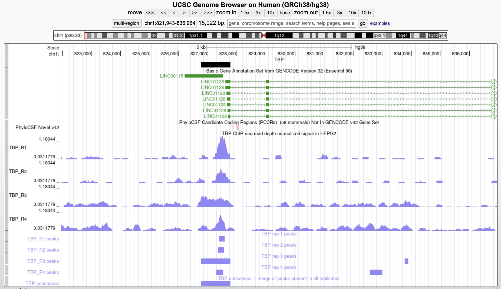
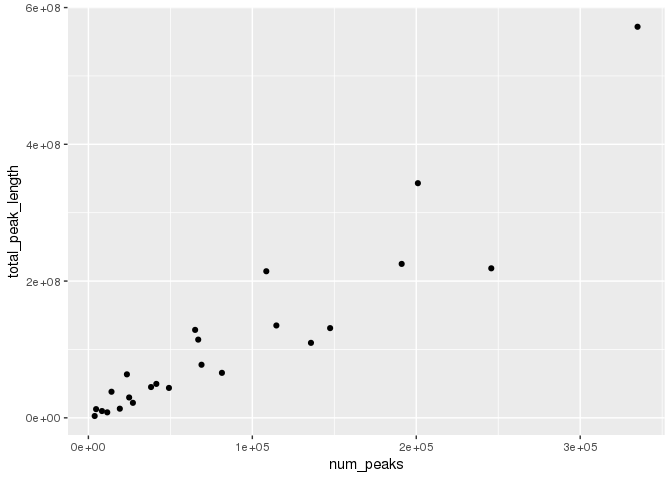
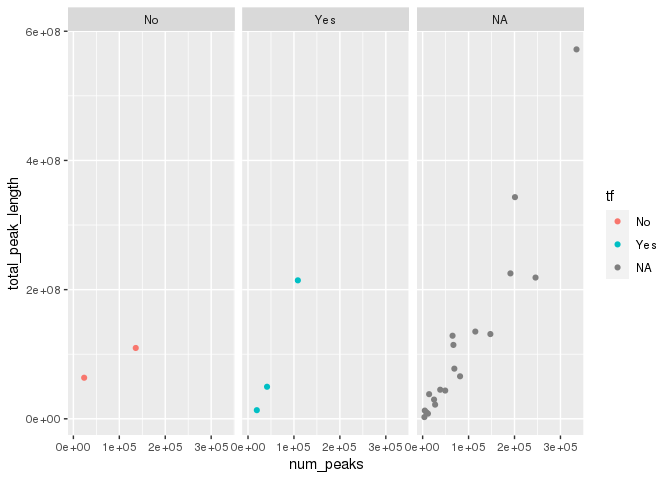
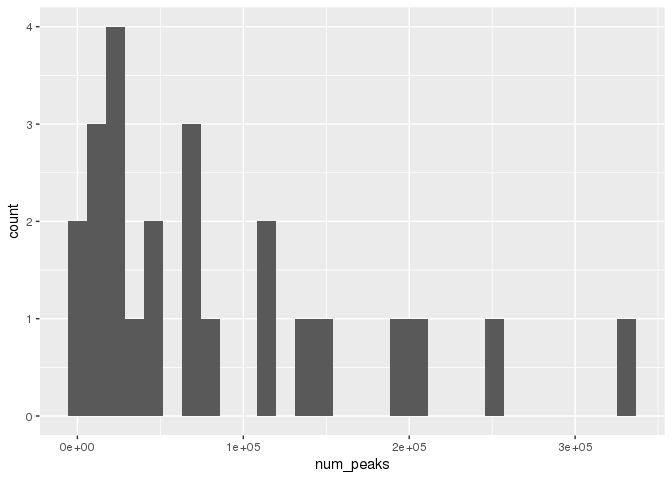
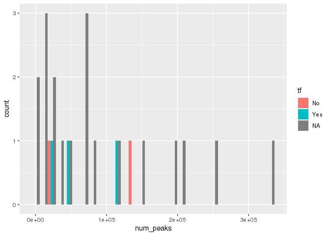

Class\_exercise
================
Georgia Barone
3/16/2023

# Loading in the libraries needed for analysis

# Here I am starting to analyze my data for my proteins of interest:

# BCRA1, H3K36me3, MAX, JUN, POLR2A, POLR2A phospho S2, POLR2A phospho S5, & TBP

# First I will read in each replicate file

``` r
# import peaks
peak_list <- import_peaks(consensus_file_path = broadpeakfilepath)

# printing out a table of the number of peaks in each file:
peak_num <- sapply(peak_list, length) %>% as.data.frame()
# label column
names(peak_num) <- c("num_peaks")

# make dbp name a col.
peak_num <- peak_num %>%
  rownames_to_column(var = "dbp") %>%
  separate(col = dbp,  into = c('dbp', 'replicate'), sep = "_")

# set working directory
setwd("/scratch/Shares/rinnclass/CLASS_2023/geba9152/CLASS_2023/CLASSES/05_R_analyses/class_activity_03202023")

# saving to results folder
write_csv(peak_num, "results/num_peaks_df.csv")
```

# Now I am going to create consensus peaks for each protein

``` r
# creating a list of unique dpbs 
dbps <- unique(sapply(names(peak_list), function(x) {
   unlist(strsplit(x, "_"))[1]
}))

# run function consensus_from_reduced
consensus_list <- lapply(dbps, consensus_from_reduced, peak_list)
names(consensus_list) <- dbps

# num_peaks for consensus 
num_consensus_peaks <- sapply(consensus_list, length) %>% 
  as.data.frame() %>%
  rownames_to_column( var = "dbp") %>%
  dplyr::rename(number_consensus_peaks = ".")

# merge into num_peaks
peak_num <- left_join(peak_num, num_consensus_peaks)
```

    ## Joining with `by = join_by(dbp)`

``` r
# export consensus peaks to results folder
write_csv(peak_num, "results/num_peaks_df.csv")

# setting file path to export
basepath <- "/scratch/Shares/rinnclass/CLASS_2023/geba9152"
consensus_path <- "CLASS_2023/CLASSES/05_R_analyses/class_activity_03202023/consensus_peaks/"
exportpath <- file.path(basepath, consensus_path)

# export consensus_list as multiple .bed files
for(i in 1:length(consensus_list)) {
rtracklayer::export(consensus_list[[i]], paste0(exportpath, names(consensus_list)[i], "_consensus_peaks.bed") )}

# cleaning up .bed files

# making list of consensus .bed files
consensus_file_list <- list.files("/scratch/Shares/rinnclass/CLASS_2023/geba9152/CLASS_2023/CLASSES/05_R_analyses/class_activity_03202023/consensus_peaks", full.names = T, pattern = ".bed")

# lapply (for loop) across consensus file list to add colnames
# col names for .broadPeak are: chr, start, end, name, score, strand
peaks <- lapply(consensus_file_list, read.table, col.names = c("chr", "start", "end", "name", "score", "strand"))

# adding dpbs as names for the peaks file
names(peaks) <- dbps

# remove contigs from peak files
# make chromosomes of interest object
canonical_chr <- c(paste0("chr", 1:22), "chrM", "chrX", "chrY")

# use lapply with filter function to cannonical_chr
peaks <- lapply(peaks, function(x) x %>% filter(chr %in% canonical_chr))


# export new files without contigs
new_filenames <- paste0("consensus_peaks/", names(peaks), "_consensus.bed")

for(i in 1:length(peaks)) {
  write.table(peaks[[i]], new_filenames[[i]],
              sep = "\t", col.names = FALSE, row.names = FALSE,
              quote = FALSE, append = TRUE)
}
```

# Now I am going to make my consensus peaks compatable with UCSC genome browser

``` r
# adding a header to make compatible with UCSC 
# using paste0 to print the header text & then adding the names as the value the header equals with 'names' function
headers <- paste0("track type=bed name=", names(peaks))

# create a path to export after we add header (using the loop below)
new_filenames <- paste0("ucsc_consensus_peaks/", names(peaks), ".bed")

# write new ucsc .bed files to ucsc file path using loop below
for(i in 1:length(peaks)) {
  # Write the header line
  writeLines(headers[[i]], new_filenames[[i]])
  # Append the broadPeak table data
  
  write.table(peaks[[i]], new_filenames[[i]],
              sep = "\t", col.names = FALSE, row.names = FALSE,
              quote = FALSE, append = TRUE)
}
```

# Now I want to compare a protein with a previous analysis

## Here my TBP consensus peak (from code above) overlayed with the Spring 2021 TBP chip data

## Shown in the JPG below are two consensus peaks called from my code, that align with the Spring 2021 data

``` r
# goto UCSC genome browser and load in a peak file for a given protein
# load in the data for the same protein from the previous analysis
# compare how your consensus peaks are similar or different to previous analyses

knitr::include_graphics("/scratch/Shares/rinnclass/CLASS_2023/geba9152/CLASS_2023/CLASSES/05_R_analyses/class_activity_03202023/TBP_genomebrowser.jpg") 
```



# Now I am going to determine how my peaks for each protein overlap annotations of the genome

# First I will find the overlaps between my consensus peaks with promoters of lncRNA and mRNA promoters

``` r
# find overlaps of promoters for each protein
# filepath to import peaks
basepath <- "/scratch/Shares/rinnclass/CLASS_2023/geba9152"
peak_path <- "CLASS_2023/CLASSES/05_R_analyses/class_activity_03202023/consensus_peaks"
consensusPeakPath <- file.path(basepath, peak_path)

# making consensus peak file variable
consensus_peaks_files <- list.files(consensusPeakPath, 
                                             pattern = "*.bed",
                                             full.names = TRUE)

# lapply with import function to make a list of GRanges
consensus_peaks <- lapply(consensus_peaks_files, rtracklayer::import)

# adding DBP name to each list of GRanges from the file name
names(consensus_peaks) <- gsub("/scratch/Shares/rinnclass/CLASS_2023/geba9152/CLASS_2023/CLASSES/05_R_analyses/class_activity_03202023/consensus_peaks/|_consensus.bed","", consensus_peaks_files)

# load in gencode lncrna & mrna annotation files 
load("/scratch/Shares/rinnclass/CLASS_2023/geba9152/CLASS_2023/CLASSES/05_R_analyses/01_peak_features/results/peak_features.RData")

# counting promoter overlaps
promoter_peak_counts <- count_peaks_per_feature(lncrna_mrna_promoters, consensus_peaks, type = "counts")

# row sum for each DBP to get overlaps at each promoter
num_peaks_df$peaks_overlapping_promoters <- rowSums(promoter_peak_counts)

# filtering data frame down
num_peaks_df_for_analysis <- num_peaks_df %>% filter(!row_number() %in% c(2,3,5,6,8,9,11,12,14,15,17,18,20,21,23,24))

# adding % columns for all promoters
num_peaks_df_for_analysis$percent_peaks_overlap_promoters <- (num_peaks_df_for_analysis$peaks_overlapping_promoters/36814)*100
```

## results:

\#1) What can you determine from these overlaps?

### BRCA1 peak overlaps with promoters: 14420, 39.16% of all promoters

### H3K36me3 peak overlaps with promoters: 2179, 5.92% of all promoters

### JUN peak overlaps with promoters: 700, 1.90% of all promoters

### MAX peak overlaps with promoters: 18524, 50.32% of all promoters

### POL2RA peak overlaps with promoters: 5102, 13.86% of all promoters

### POL2RA phosphoS2 peak overlaps with promoters: 8411, 22.85% of all promoters

### POL2RA phosphoS5 peak overlaps with promoters: 17143, 46.57% of all promoters

### TBP peak overlaps with promoters: 8480, 23.03% of all promoters

### Note\*\*\* percentages obtained above are from dividing peaks at promoters by total peaks

# Now I want to compare the overlaps with lncRNA and mRNA promoters seperately

``` r
# breaking into lncrna & mrna

# lncrna promoter overlaps
num_peaks_df$peaks_overlapping_lncrna_promoters <- rowSums(promoter_peak_counts[,lncrna_gene_ids])
# mrna promoter overlaps
num_peaks_df$peaks_overlapping_mrna_promoters <- rowSums(promoter_peak_counts[,mrna_gene_ids])

# save to num_peaks_df
write_csv(num_peaks_df, "results/num_peaks_df.csv")

# adding % columns for mRNA promoters and lncRNA promoters
# mRNA promoters
num_peaks_df_for_analysis$percent_mRNApeaks_overlap_promoters <- (num_peaks_df_for_analysis$peaks_overlapping_mrna_promoters/num_peaks_df_for_analysis$num_peaks)*100

# lncRNA promoters
num_peaks_df_for_analysis$percent_lncRNApeaks_overlap_promoters <- (num_peaks_df_for_analysis$peaks_overlapping_lncrna_promoters/num_peaks_df_for_analysis$num_peaks)*100

# making df for mRNA promoters (just to visualize)
num_peaks_mRNA_lncRNA <- num_peaks_df_for_analysis[c(1,13,14,15)]
```

## results:

\#1) What is the difference in overlaps between mRNA and lncRNA
promoters

# mRNA promoters

### BRCA1 peak overlaps with mRNA promoters: 11032, 8.13% of all mRNA promoters

### H3K36me3 peak overlaps with mRNA promoters: 618, 0.18% of all mRNA promoters

### JUN peak overlaps with mRNA promoters: 469, 2.45% of all mRNA promoters

### MAX peak overlaps with mRNA promoters: 13353, 12.3% of all mRNA promoters

### POL2RA peak overlaps with mRNA promoters: 3854, 16.4% of all mRNA promoters

### POL2RA phosphoS2 peak overlaps with mRNA promoters: 57493, 3% of all mRNA promoters

### POL2RA phosphoS5 peak overlaps with mRNA promoters: 12730, 5.17% of all mRNA promoters

### TBP peak overlaps with mRNA promoters: 6724, 16.23% of all mRNA promoters

# lncRNA promoters

### BRCA1 peak overlaps with lncRNA promoters: 3388, 2.5% of all lncRNA promoters

### H3K36me3 peak overlaps with lncRNA promoters: 1561, 0.47% of all lncRNA promoters

### JUN peak overlaps with lncRNA promoters: 231, 1.2% of all lncRNA promoters

### MAX peak overlaps with lncRNA promoters: 5171, 4.76% of all lncRNA promoters

### POL2RA peak overlaps with lncRNA promoters: 1248, 5.31% of all lncRNA promoters

### POL2RA phosphoS2 peak overlaps with lncRNA promoters: 2662, 1.14% of all lncRNA promoters

### POL2RA phosphoS5 peak overlaps with lncRNA promoters: 4413, 1.8% of all lncRNA promoters

### TBP peak overlaps with lncrna promoters: 1756, 4.24% of all lncRNA promoters

### Note\*\*\* percentages obtained above are from dividing peaks at promoters by total peaks

# Proteins seem to have fewer peaks in lncRNA promoters compared to mRNA promoters

# This makes sense because mRNA transcripts produce proteins

# Now I am going to test if there is more binding over gene bodies than promoters

# I will seperate lncRNA and mRNA gene bodies to find the overlaps

``` r
# finding overlaps with gene_bodies 
genebody_peak_counts <- count_peaks_per_feature(mrna_lncrna_genes, 
                                                consensus_peaks, 
                                                type = "counts")

# looking all gene bodies
num_peaks_df$peaks_overlapping_genebody <- 
  rowSums(genebody_peak_counts)

# lncRNA gene bodies 
num_peaks_df$peaks_overlapping_lncrna_genebody <- rowSums(genebody_peak_counts[,lncrna_gene_ids])

# mRNA gene bodies
num_peaks_df$peaks_overlapping_mrna_genebody <- 
  rowSums(genebody_peak_counts[,mrna_gene_ids])

# add to num_peaks_df for analysis
write_csv(num_peaks_df, "results/num_peaks_df.csv")

# adding % columns for total, mRNA, & lncRNA genebody overlaps

# genebody overlaps
num_peaks_df_for_analysis$percent_peaks_overlap_genebody <- (num_peaks_df_for_analysis$peaks_overlapping_genebody/num_peaks_df_for_analysis$num_peaks)*100

# mRNA genebody overlaps
num_peaks_df_for_analysis$percent_mRNApeaks_overlap_genebody <- (num_peaks_df_for_analysis$peaks_overlapping_mrna_genebody/num_peaks_df_for_analysis$num_peaks)*100

# lncRNA genebody overlaps
num_peaks_df_for_analysis$percent_lncRNApeaks_overlap_genebody <- (num_peaks_df_for_analysis$peaks_overlapping_lncrna_genebody/num_peaks_df_for_analysis$num_peaks)*100

# making df for mRNA promoters (just to visualize)
num_peaks_mRNA_lncRNA <- num_peaks_df_for_analysis[c(1,9,16,17,18)]
```

## results:

# 1) Do my proteins have more overlaps with promoters or genebodies?

# all gene body overlaps

### BCRA1: 26993, 19.88% of all gene bodies

### H3K36me3: 76443, 22.81% of all gene bodies

### JUN: 3328, 17.36% of all gene bodies

### MAX: 60723, 55.95% of all gene bodies

### POL2RA: 7087, 30.16% of all gene bodies

### POL2RA phosphoS2: 42324, 22.15 of all gene bodies

### POL2RA phosphoS5: 53738, 21.87% of all gene bodies

### TBP: 11110, 26.81% of all gene bodies

# mRNA

### BCRA1 promoter overlaps (from above): 11032, 8.13% of all mRNA promoters

### BCRA1 gene body overlaps: 21406, 15.77% of mRNA gene bodies

## BCRA1 contains more gene body overlaps than promoter overlaps

### H3K36me3 promoter overlaps: 618, 0.18% of all mRNA promoters

### H3K36me3 gene body overlaps: 70974, 21.19% of mRNA gene bodies

## H3K36me3 contains more gene body overlaps than promoter overlaps

### JUN promoter overlaps: 2.45% of all mRNA promoters

### JUN gene body overlaps: 2486, 12.96% of mRNA gene bodies

## JUN contains more gene body overlaps than promoter overlaps

### MAX promoter overlaps: 12.3% of all mRNA promoters

### MAX gene body overlaps: 47064, 43.37% of mRNA gene bodies

## MAX contains more gene body overlaps than promoter overlaps

### POL2RA promoter overlaps: 16.4% of all mRNA promoters

### POL2RA gene body overlaps: 5656, 24.07% of mRNA gene bodies

## POL2RA contains more gene body overlaps than promoter overlaps

### POL2RA phosphoS2 promoter overlaps: 3% of all mRNA promoters

### POL2RA phosphoS2 gene body overlaps: 37283, 19.51% of mRNA gene bodies

## POL2RA phosphoS2 contains more gene body overlaps than promoter overlaps

### POL2RA phosphoS5 promoter overlaps: 5.17% of all mRNA promoters

### POL2RA phosphoS5 gene body overlaps: 45575, 18.54% of mRNA gene bodies

## POL2RA phosphoS5 contains more gene body overlaps than promoter overlaps

### TBP promoter overlaps: 16.23% of all mRNA promoters

### TBP gene body overlaps: 9040, 21.81% of mRNA gene bodies

## TBP contains more gene body overlaps than promoter overlaps

# lncRNA

### BCRA1 promoter overlaps (from above): 2.5% of all lncRNA promoters

### BCRA1 gene body overlaps: 5587, 4.11% of lncRNA gene bodies

## BCRA1 contains more gene body overlaps than promoter overlaps

### H3K36me3 promoter overlaps: 0.47% of all lncRNA promoters

### H3K36me3 gene body overlaps: 5469, 1.63% of lncRNA gene bodies

## H3K36me3 contains more gene body overlaps than promoter overlaps

### JUN promoter overlaps: 1.2% of all lncRNA promoters

### JUN gene body overlaps: 842, 4.39% of lncRNA gene bodies

## JUN contains more gene body overlaps than promoter overlaps

### MAX promoter overlaps: 4.76% of all lncRNA promoters

### MAX gene body overlaps: 13659, 12.59% of lncRNA gene bodies

## MAX contains more gene body overlaps than promoter overlaps

### POL2RA promoter overlaps: 5.31% of all lncRNA promoters

### POL2RA gene body overlaps: 1431, 6.09% of lncRNA gene bodies

## POL2RA contains more gene body overlaps than promoter overlaps

### POL2RA phosphoS2 promoter overlaps: 1.14% of all lncRNA promoters

### POL2RA phosphoS2 gene body overlaps: 5041, 2.64% of lncRNA gene bodies

## POL2RA phosphoS2 contains more gene body overlaps than promoter overlaps

### POL2RA phosphoS5 promoter overlaps: 1.8% of all lncRNA promoters

### POL2RA phosphoS5 gene body overlaps: 8163, 3.32% of lncRNA gene bodies

## POL2RA phosphoS5 contains more gene body overlaps than promoter overlaps

### TBP promoter overlaps: 4.24% of all lncRNA promoters

### TBP gene body overlaps: 2070, 5% of lncRNA gene bodies

## TBP contains more gene body overlaps than promoter overlaps

### Note\*\*\* percentages obtained above are from dividing peaks at gene bodies by total peaks

# I am curious if my proteins are transcription factors so I will use the annotations in a cell paper I found and see

## Using this code, num\_peaks will now contain a column that says wether my protein of interest is a TF

``` r
# downloading TF annotations 
url <- "https://www.cell.com/cms/10.1016/j.cell.2018.01.029/attachment/ede37821-fd6f-41b7-9a0e-9d5410855ae6/mmc2.xlsx"

destination_for_url <- "results/TF_annotations.xlsx"

# to download we can use download.file
download.file(url, destination_for_url)

# creating human TFs variable
human_tfs <- readxl::read_excel("results/TF_annotations.xlsx",
                                sheet = 2, skip = 1)
```

    ## Warning: Expecting logical in M1006 / R1006C13: got 'Contains a SANT and
    ## multiple DNA-binding C2H2 domains. Motif is 99% AA ID from mouse (Transfac).'

    ## Warning: Expecting logical in M1021 / R1021C13: got 'Close ortholog (PP1RA)
    ## binds to mRNA; single-stranded DNA (ssDNA); poly(A) and poly(G) homopolymers
    ## (Uniprot)'

    ## Warning: Expecting logical in M1542 / R1542C13: got 'Contains 1 SANT domain'

    ## Warning: Expecting logical in M1543 / R1543C13: got 'Contains 2 Myb DBDs.
    ## Sources of Hocomoco/Transfac motifs are unclear. However these sequences look
    ## similar to in vitro sites selected by SELEX (PMID:11082045)'

    ## Warning: Expecting logical in M1544 / R1544C13: got 'Although CHD2 has weak
    ## similarity to a Myb domain (PMID:9326634), it's more closely related to the
    ## non-DNA-binding SANT domain based on our alignment analysis. The data showing
    ## that show that CHD2 binding histone H3.3 (PMID:22569126) further support the
    ## conclusion that the Myb domain is probably a SANT domain facilitating the
    ## histone interaction'

    ## Warning: Expecting logical in M1545 / R1545C13: got 'Contains a single SANT
    ## domain, no evidence for sequence-specific DNA binding'

    ## Warning: Expecting logical in M1546 / R1546C13: got 'Contains 2 Myb DBDs'

    ## Warning: Expecting logical in M1547 / R1547C13: got 'Contains 2 SANT domains,
    ## and no other putative DNA-binding domains'

    ## Warning: Expecting logical in M1548 / R1548C13: got 'Contains 2 SANT domains,
    ## and no other putative DNA-binding domains'

    ## Warning: Expecting logical in M1549 / R1549C13: got 'Contains a single SANT
    ## domain, no evidence for sequence-specific DNA binding'

    ## Warning: Expecting logical in M1550 / R1550C13: got 'Domain is truncated, and
    ## there is nothing known about this gene'

    ## Warning: Expecting logical in M1551 / R1551C13: got 'Contains a single SANT
    ## domain, no evidence for sequence-specific DNA binding'

    ## Warning: Expecting logical in M1552 / R1552C13: got 'MIER2's Myb domain is more
    ## similar to the non-DNA-binding SANT domain'

    ## Warning: Expecting logical in M1553 / R1553C13: got 'MIER3's Myb domain is more
    ## similar to the non-DNA-binding SANT domain'

    ## Warning: Expecting logical in M1554 / R1554C13: got 'Contains 1 SANT domain,
    ## and a SANTA domain'

    ## Warning: Expecting logical in M1555 / R1555C13: got 'Contains a single Myb-like
    ## domain with an insertion in the middle. It is ambiguous whether Myb-like
    ## domains are DNA or protein binding. Since it has a single domain it's likely
    ## non-specific, but future experiments should be performed to assay it's
    ## specificity'

    ## Warning: Expecting logical in M1556 / R1556C13: got 'Contains 3 Myb DBDs'

    ## Warning: Expecting logical in M1557 / R1557C13: got 'Contains 3 Myb DBDs'

    ## Warning: Expecting logical in M1558 / R1558C13: got 'Contains 3 Myb DBDs'

    ## Warning: Expecting logical in M1559 / R1559C13: got 'Contains a single Myb-like
    ## domain. Mouse ortholog has motif'

    ## Warning: Expecting logical in M1560 / R1560C13: got 'MYSM1 has been shown to
    ## bind DNA ? interaction with DNA requires the MYSM1 Myb but not the SWIRM domain
    ## (PMID:17428495). Domain sequence alignment places it near DNA-binding Myb
    ## domains but scores slightly higher as a SANT rather than Myb domain based on
    ## Prosite patterns. Given that most Myb proteins that bind DNA sequence
    ## specifically have multiple Myb domains in an array this protein could bind DNA
    ## sequence non-specifically with it?s single Myb domain. Future experiments
    ## should assay MYSM1?s specificity'

    ## Warning: Expecting logical in M1561 / R1561C13: got 'Contains 2 SANT domains,
    ## and no other putative DNA-binding domains'

    ## Warning: Expecting logical in M1562 / R1562C13: got 'Contains 2 SANT domains,
    ## and no other putative DNA-binding domains'

    ## Warning: Expecting logical in M1564 / R1564C13: got 'Contains 2 SANT domains,
    ## and no other putative DNA-binding domains'

    ## Warning: Expecting logical in M1565 / R1565C13: got 'Contains 2 SANT domains,
    ## and no other putative DNA-binding domains'

    ## Warning: Expecting logical in M1566 / R1566C13: got 'Contains 2 SANT domains,
    ## and no other putative DNA-binding domains. RCOR3 SANT domains are known to
    ## facilitate PPIs'

    ## Warning: Expecting logical in M1567 / R1567C13: got 'SMARCA1 contains a
    ## truncated Myb-like and SANT domain. Given the presence of the Myb-like domain,
    ## and other domains known to associated with DNA (DEAD box helicase) it likely
    ## associates with DNA non-sequence-specifically'

    ## Warning: Expecting logical in M1568 / R1568C13: got 'Contains a SANT, and
    ## Myb-like domain'

    ## Warning: Expecting logical in M1569 / R1569C13: got 'Contains 1 SANT domain,
    ## and no other putative DNA-binding domains. Motif logos look like bZIP dimeric
    ## binding sites, and are thus likely specificifities of SMARCC1 interactors'

    ## Warning: Expecting logical in M1570 / R1570C13: got 'Contains 1 SANT domain,
    ## and no other putative DNA-binding domains. Motif logos ares likely
    ## specificifities of SMARCC2 interactors'

    ## Warning: Expecting logical in M1571 / R1571C13: got 'Contains only Myb DBDs'

    ## Warning: Expecting logical in M1572 / R1572C13: got 'Contains 1 SANT domain'

    ## Warning: Expecting logical in M1573 / R1573C13: got 'TADA2B contains a single
    ## SANT domain and is thus unlikely to bind DNA'

    ## Warning: Expecting logical in M1574 / R1574C13: got 'Contains a single Myb
    ## domain (with slightly less simialrity to a SANT domain.) This domain has been
    ## shown to be involved in PPIs but this may not be mutually exclusive with
    ## DNA-binding. The sequence-specificity of CCDC79 should be investigated in the
    ## future'

    ## Warning: Expecting logical in M1575 / R1575C13: got 'Contains 1 Myb domain, and
    ## has structural evidence of DNA-binding'

    ## Warning: Expecting logical in M1576 / R1576C13: got 'Motif is inferred from
    ## mouse (92% DBD AA ID)'

    ## Warning: Expecting logical in M1577 / R1577C13: got 'TERF2IP contains a single
    ## Myb-like domain. While it's unclear if TERF2IP (Human Rap1) contacts DNA
    ## directly it has been shown to affect the DNA binding activity of TRF2'

    ## Warning: Expecting logical in M1578 / R1578C13: got 'This protein contains Myb,
    ## and Myb-like domains and is annotated as a Pol1 terminator. TTF1 DNA-binding
    ## has been demonstrated in vitro (PMID: 7597036), but it's specificity has not
    ## been determined'

    ## Warning: Expecting logical in M1579 / R1579C13: got 'Contains 1 Myb DBD'

    ## Warning: Expecting logical in M1580 / R1580C13: got 'Contains a GATA and SANT
    ## domain. Unclear whether the GATA domain is a bona fide DBD as the MTA/RERE
    ## family domains are atypical to human GATA domains (see alignment). In CIS-BP
    ## there is one protein from C.elegans that shares domain homology and binds a
    ## GATA motif (elg-27, ChIP-seq). The GATA ZnF domain of MTA1 is required for it's
    ## interaction with RBBP4 and RBBP7 (PMID:18067919). Full-length protein has been
    ## tried in HT-SELEX and did not yield a motif'

    ## Warning: Expecting logical in M1581 / R1581C13: got 'Contains a GATA and SANT
    ## domain. Unclear whether the GATA domain is a bona fide DBD as the MTA/RERE
    ## family domains are atypical to human GATA domains (see alignment). In CIS-BP
    ## there is one protein from C.elegans that shares domain homology and binds a
    ## GATA motif (elg-27, ChIP-seq). Full-length protein has been tried in HT-SELEX,
    ## and DBD has been tried on PBM - neither yielded motifs'

    ## Warning: Expecting logical in M1582 / R1582C13: got 'Contains a GATA and SANT
    ## domain. Unclear whether the GATA domain is a bona fide DBD as the MTA/RERE
    ## family domains are atypical to human GATA domains (see alignment). In CIS-BP
    ## there is one protein from C.elegans that shares domain homology and binds a
    ## GATA motif (elg-27, ChIP-seq). Hasn't been tried in any in vitro assays'

    ## Warning: Expecting logical in M1583 / R1583C13: got 'Contains a GATA and SANT
    ## domain. Unclear whether the GATA domain is a bona fide DBD as the MTA/RERE
    ## family domains are atypical to human GATA domains (see alignment). In CIS-BP
    ## there is one protein from C.elegans that shares domain homology and binds a
    ## GATA motif (elg-27, ChIP-seq). Has been tried as a DBD in HT-SELEX but did not
    ## yield a motif'

    ## Warning: Expecting logical in M1791 / R1791C13: got 'CNOT3 is a part of the
    ## CCR4-NOT complex involved in mRNA decay'

    ## Warning: Expecting logical in M1932 / R1932C13: got '"Prosite identifies a
    ## low-confidence Myb-like domain (e.g. can?t decide between Myb and SANT) so it?s
    ## probably not a TF"'

    ## New names:
    ## • `` -> `...4`

``` r
# rename the 4th column to indicate if it is a TF
names(human_tfs)[4] <- "is_tf"

# intersection of gene names that are in our ChIP data and has a TF identity
length(which(tolower(num_peaks_df$dbp) %in% tolower(human_tfs$Name)))
```

    ## [1] 5

``` r
# grabbing first 4 columns 
human_tfs <- human_tfs[tolower(human_tfs$Name) %in% tolower(num_peaks_df$dbp), 1:4]

# adding new column names
names(human_tfs) <- c("ensembl_id",
                      "dbp",
                      "dbd",
                      "tf")

# merge TF annotation to num_peaks_df
num_peaks_df <- merge(num_peaks_df, human_tfs, all.x = T)

# Let's check how many NAs -- we should have some missing values
dim(num_peaks_df[is.na(num_peaks_df$tf),])
```

    ## [1] 19 12

``` r
# cleaning up df 
num_peaks_df <- num_peaks_df[,1:12]
write_csv(num_peaks_df, "results/num_peaks_df.csv")
```

# It is nice and all to find overlaps, but I am interested in how many proteins bind a specific promoter.

# I will use my handy “occurence” parameter in " count peaks per feature"

``` r
# using using count_peaks_per_feature to get occurence parameter
promoter_peak_occurence <- count_peaks_per_feature(lncrna_mrna_promoters, consensus_peaks, 
                                               type = "occurrence")

# double check that all lncrna & mrna genes are accounted for:
stopifnot(all(colnames(promoter_peak_occurence) == lncrna_mrna_promoters$gene_id))

# saving information to table
write.table(promoter_peak_occurence, "results/lncrna_mrna_promoter_peak_occurence_matrix.tsv")

# making sure promoter_peak_occurrence and lncrna_mrna_promoters are in the same order
stopifnot(all(colnames(promoter_peak_occurence) == lncrna_mrna_promoters$gene_id))

# creating peak_occurence df
peak_occurence_df <- data.frame("gene_id" = colnames(promoter_peak_occurence),
                                "gene_name" = lncrna_mrna_promoters$gene_name,
                                "gene_type" = lncrna_mrna_promoters$gene_type,
                                "chr" = lncrna_mrna_promoters@seqnames,   
                                "1kb_up_tss_start" = lncrna_mrna_promoters@ranges@start,
                                "strand" = lncrna_mrna_promoters@strand,
                                "number_of_dbp" = colSums(promoter_peak_occurence))
```

## results: values found in the peak\_occurence\_df

### BCRA1: N/A - not in annotation file

### H3K36me3: N/A - not in annotation file

### JUN: max \# of proteins on a promoter is 18

### MAX: max \# of proteins on a promoter is 15

### POL2RA: N/A - not in annotation file

### POL2RA phosphoS2: N/A - not in annotation file

### POL2RA phosphoS5: N/A - not in annotation file

### TBP: max \# of proteins on a promoter is 18

# Now I want to start plotting my results

# First I will see if there is a realtionship between peak number and total DNA covered

## Result:

### Yes there is a relationship between peak number and total DNA covered, the more number of peaks, the more DNA covered.

### See below:

``` r
ggplot(num_peaks_df, aes(x = num_peaks, 
                         y = total_peak_length)) +
  geom_point() 
```

<!-- -->

# Now I want to color my plot by wether the protein is a TF or not.

### See below:

``` r
ggplot(num_peaks_df, aes(x = num_peaks, 
                 y = total_peak_length,
                 color = tf)) +
  facet_wrap(tf ~ .) +
  geom_point() 
```

<!-- -->

# I want to make a histogram of the number of peaks for each of my proteins

### See below:

``` r
ggplot(num_peaks_df, aes(x = num_peaks)) +
  geom_histogram()
```

    ## `stat_bin()` using `bins = 30`. Pick better value with `binwidth`.

<!-- -->

# Now I want to facet this by the type of DNA binding domain my protein has.

### See below:

``` r
ggplot(num_peaks_df, aes(x = num_peaks, fill = tf)) +
   geom_histogram(bins = 30, position = "dodge")
```

<!-- -->
